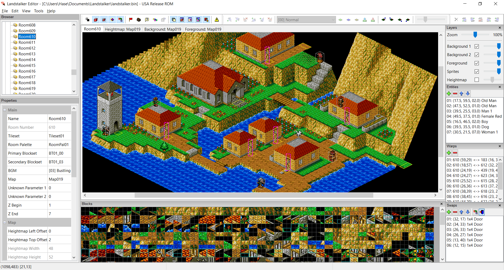

# landstalker_gfx
Landstalker Graphics Viewer

# Linux

## Packages

In addition to build-essential (compiler and make), the following libraries are required:
- wxWidgets
- libpng
- zlib
- boost

### Ubuntu

```sh
# apt install libwxgtk3.0-gtk3-dev libpng-dev zlib1g-dev libboost-all-dev
```

### Arch Linux

```sh
# pacman -S wxgtk3 zlib libpng boost
# ln -s /usr/bin/wx-config-gtk3 /usr/bin/wx-config
```

## Build

### With make

 build using the Makefile by calling make

```sh
$ make
```

To build with debug symbols, use pass the DEBUG=yes parameter to make

```sh
$ make DEBUG=yes
```

# Windows

## Visual Studio 2019 (Community)

### Prerequisites

#### WxWidgets

You will need to download and build the WxWidgets 3.1.3 library (https://www.wxwidgets.org/). Download the Windows ZIP version and extract somewhere convenient (e.g. the root of the C: drive). Note that the final extracted path cannot contain spaces.

Navigate to the extracted WxWidgets sources and go to the build\msw directory. Open the wx_vc16.sln solution file. Go to the "Build" menu and select "Batch Build...". In the batch build window, click the "Select All" button and then click "Build" (note that this will take some time). Once all files have been built, exit out of Visual Studio.

Finally, we need to add an environment variable to tell Visual Studio where to find the WxWidgets files. Open the Start menu, right click on "Computer" and select "Properties". Click on "Advanced System Settings" and then "Environment Variables". Add a new System Environment Variable named WX_WIN, and set its value equal to the full path to the WxWidgets directory (e.g. "C:\libraries\WxWidgets-3.1.3"). Click OK and exit out of the system properties windows.

Make sure that Visual Studio has been restarted so that it picks up the new environment variable.

#### LibPng and ZLib

You will need to obtain the LibPng 1.6.37 library - this can be found at https://download.sourceforge.net/libpng/lpng1637.zip. You will also need the ZLib source, download this from https://www.zlib.net/zlib-1.2.11.tar.gz.

Extract both archives to a common directory (e.g. C:\libraries). Once extracted, you should have a "lpng1637" folder and a "zlib-1.2.11" folder. Rename the zlib folder to "zlib" (i.e. remove the version from the folder name).

Navigate to lpng1637/projects/vstudio and open the zlib.props file with a text editor. Change the ```<TreatWarningAsError>``` value from ```true``` to ```false```. Save the file.

Next, open the vstudio.sln file. You will be prompted to upgrade the solution file to the latest version - choose "Yes". Once converted, go to the "Build" menu and select "Batch Build...". In the batch build window, click the "Select All" button and then click "Build". Once all files have been built, exit out of Visual Studio.

Finally, we need to add an environment variable to tell Visual Studio where to find libpng. Open the Start menu, right click on "Computer" and select "Properties". Click on "Advanced System Settings" and then "Environment Variables". Add a new System Environment Variable named LIBPNG_PATH, and set its value equal to the full path to libpng (e.g. "C:\libraries\libpng1637"). Click OK and exit out of the system properties windows.

Make sure that Visual Studio has been restarted so that it picks up the new environment variable.

## Boost

Boost can be obtained here: https://www.boost.org/users/download/. You should download the latest zip file release.

Extract the boost libraries to a common directory (e.g. C:\libraries). Once extracted, you should have a "boost_*x*" directory, where *x* is the version number.

Open a command prompt in this directory, and enter the following commands:
- ```bootstrap```
- ```.\b2```

Finally, we need to add an environment variable to tell Visual Studio where to find the Boost libraries. Open the Start menu, right click on "Computer" and select "Properties". Click on "Advanced System Settings" and then "Environment Variables". Add a new System Environment Variable named BOOST_PATH, and set its value equal to the full path to Boost (e.g. "C:\libraries\boost_1_78_0"). Click OK and exit out of the system properties windows.

Make sure that Visual Studio has been restarted so that it picks up the new environment variable.

### Build

Open the VS2019 solution file in landstalker_gfx\VC2019. Make sure that the appropriate configuration has been set (e.g. "Debug x86") and hit Ctrl+Shift+B to build.

# Note

* The ROM path cannot contain a folder that start with a dot.

# Screenshot


