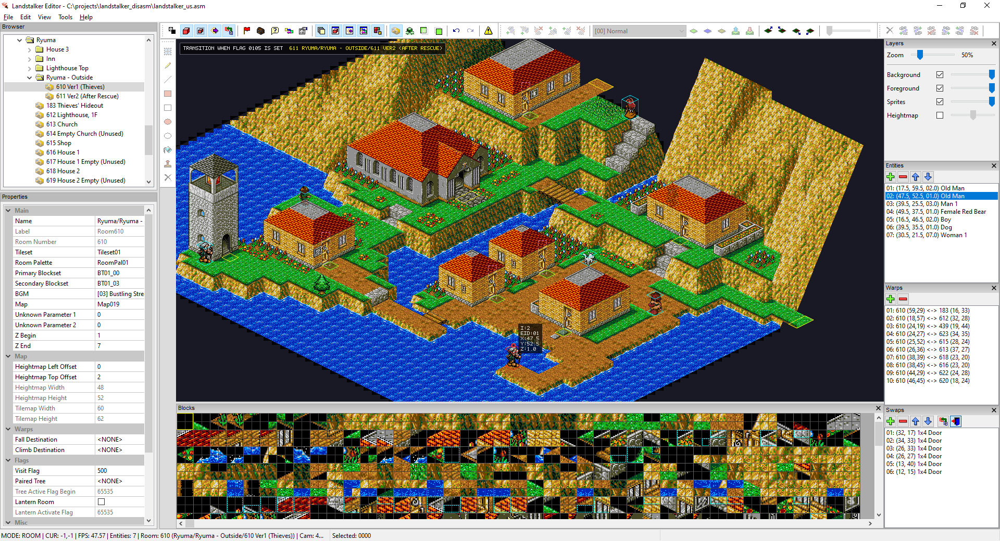

# Landstalker Editor

A tool for extracting, viewing, editing and re-inserting the various data structures and code found in the Landstalker disassembly amd ROMs.

This tool can work with assembly files from the Landstalker Disassembly project: [Landstalker Disassembly](https://github.com/lordmir/landstalker_disasm) - It can open one of the top-level ASM files for the desired region (e.g. `landstalker_us_expanded.asm`). This is the best way to edit the game, and this way offers the most flexibility and features (e.g. script editing). Each region's top-level ASM file comes with an `expanded` variant - this expands the available ROM space to 4MB, double the original 2MB, which offers a lot more room for expansion. The editor will run the build process to create the ROM file automatically on save, however it can be built directly by running `build.bat` or `build.sh` in the `landstalker_disasm` folder with the appropriate arguments. See [here](https://github.com/lordmir/landstalker_disasm/blob/master/README.md) for more details.

This tool can also work with the six publicly available retail ROM versions. However, the editor is far more restricted in this mode, and editing ROM files directly can be risky as there is less space available for modifications. ROM files built elsewhere (e.g. from the assembly) will not work with the editor - the editor relies on fixed addresses to find the relevant data sections, and the nature of the reassembly is that some sections will be reorganized internally and therefore become relocated to different ROM addresses. It is always recommended to work with Assembly files instead of directly with ROMs if you are planning more complex editing.

# Documentation / User Manual

Work-in-progress documentation [here](https://github.com/lordmir/landstalker_editor/wiki).

## Screenshot



# Video Demonstrations

| [](https://www.youtube.com/watch?v=KPmFZTG75sg) | [](https://www.youtube.com/watch?v=ozUC3DsCItQ) |
|--|--|
| Map and Sprite Editing Demo, version 0.3.4 | Text, Graphics, Room and Entity Editing Demo, version 0.2 |

## Current State of progress

| Asset                       | Viewable           | Editable           | Notes                                                      |
|-----------------------------|--------------------|--------------------|------------------------------------------------------------|
| Strings                     | :heavy_check_mark: | :heavy_check_mark: |                                                            |
| Character Script            | :heavy_check_mark: | :heavy_check_mark: |                                                            |
| Shop Script                 | :heavy_check_mark: | :heavy_check_mark: |                                                            |
| Tiles                       | :heavy_check_mark: | :heavy_check_mark: |                                                            |
| 2D Maps                     | :heavy_check_mark: | :heavy_check_mark: |                                                            |
| Misc Graphics (Fonts, etc.) | :heavy_minus_sign: | :heavy_minus_sign: | 90% complete. Still need to understand end credit font.    |
| Palettes                    | :heavy_check_mark: | :heavy_check_mark: |                                                            |
| Blocksets                   | :heavy_check_mark: | :heavy_check_mark: |                                                            |
| 3D Maps                     | :heavy_check_mark: | :heavy_check_mark: |                                                            |
| Heightmaps                  | :heavy_check_mark: | :heavy_check_mark: |                                                            |
| Room Entity Placement       | :heavy_check_mark: | :heavy_check_mark: |                                                            |
| Room Warp Placement         | :heavy_check_mark: | :heavy_check_mark: |                                                            |
| Chest Contents              | :heavy_check_mark: | :heavy_check_mark: |                                                            |
| Room Character Scripts      | :heavy_check_mark: | :heavy_check_mark: |                                                            |
| Room Flags                  | :heavy_check_mark: | :heavy_check_mark: |                                                            |
| Room Graphic Transitions    | :heavy_check_mark: | :heavy_check_mark: |                                                            |
| Entity Properties           | :heavy_check_mark: | :heavy_check_mark: |                                                            |
| Entity Behaviours           | :heavy_check_mark: | :heavy_check_mark: |                                                            |
| Triggers                    | :x:                | :x:                | ROM format reverse engineered.                             |
| Room Triggers               | :x:                | :x:                | ROM format reverse engineered.                             |
| Cutscenes                   | :heavy_check_mark: | :heavy_check_mark: |                                                            |
| Sprite Frames               | :heavy_check_mark: | :heavy_check_mark: |                                                            |
| Sprite Animations           | :heavy_check_mark: | :heavy_check_mark: |                                                            |
| Audio Samples               | :x:                | :x:                | ROM format reverse engineered.                             |
| Music                       | :x:                | :x:                | ROM format reverse engineered.                             |

## Credits

Thank you to [odrevet](https://github.com/odrevet) and [Wiz](https://github.com/wizardwhosaysni) for their support and encouragement with this project. Also, thank you to [Gufino2](https://www.romhacking.net/community/820/) for his work on the original hacking/translation tools for Landstalker, and the team behind [SF2DISASM](https://github.com/ShiningForceCentral/SF2DISASM) and the [SF2 Caravan](https://github.com/ShiningForceCentral/Caravan), which was the inspiration for this project.

Also, full credit given to the developers of the third-party libraries used for this project:
- [wxWidgets](https://wxwidgets.org/)
- [GLEW](https://github.com/nigels-com/glew)
- [pugixml](https://pugixml.org/)
- [yaml-cpp](https://github.com/jbeder/yaml-cpp)
- [libpng](https://www.libpng.org/pub/png/libpng.html)
- [zlib](https://www.zlib.net/)

And, of course, a big thank you to [Kan Naito](https://x.com/Kan_Naito_J) and the team at Climax for making the original game!

# Build

## Init git submodule

```
git submodule update --init --recursive
```

## CMake

[CMake](https://cmake.org/) is a cross-platform build tool, allowing for (in theory) a more straightforward build process, regardless of the platform. All that is required is [CMake Version 3.28 or later](https://cmake.org/download/) and a C++ compiler / build environment (GCC and `build-essential` on Linux, or [Visual Studio Community Edition 2022](https://visualstudio.microsoft.com/vs/community/) on Windows).

To build, run the following commands from the top level directory of the source. For Linux:
```
cmake -S . -B build -DCMAKE_BUILD_TYPE=Release
cmake --build build --config Release -j32
cmake --install build --prefix ./install
```
Or for Windows:
```
cmake -S . -B build -A x64 -DCMAKE_BUILD_TYPE=Release
cmake --build build --config Release -j32
cmake --install build --prefix ./install
```
(Replace `Release` with `Debug` for a debug build.)

The build executable will be put in the `install/bin` directory.

Note: this will automatically attempt to download and build all of the required dependencies. If you don't want this to happen, pass in the `-DINSTALL_DEPS=OFF` parameter to CMake - CMake will then attempt to locate the same dependencies from the system.

## Docker

### Build the image

``` 
docker build -t landstalker_editor .
```

### Run a container 

Open bash inside the container

```
docker run --rm -it -v "$PWD":/workspace landstalker_editor bash
```

When inside the container the application can be build using `cmake . && make` (see `Linux build`)
or in one step:  

```
docker run --rm -it -v "$PWD":/workspace landstalker_editor sh -c "cmake . && make"
```

## Linux

### Packages

In addition to build-essential (compiler and make), the following libraries are required:
- [wxWidgets](https://www.wxwidgets.org/downloads/) (at least v3.2.2)
- [yaml-cpp](https://github.com/jbeder/yaml-cpp) (`libyaml-cpp-dev` via `apt get` on Ubuntu) (at least v0.7.0)
- libpng (`libpng-dev` via `apt get` on Ubuntu)
- zlib (`libz1g-dev` via `apt get` on Ubuntu)
- pugixml (`libpugixml-dev` via `apt get` on Ubuntu)
- GLEW (`libglew-dev` via `apt get` on Ubuntu)
- cmake

It is recommended to have the following installed in addition to the above, in order to build assemblies:
- git
- wine
- kega-fusion

#### Build and Install wxWidgets (all distributions)

 1. Download the wxWidgets v3.2+ source from the [official website](https://www.wxwidgets.org/downloads/). Extract the contents of the tar file to a suitable location.
 2. Install the prerequisites (see the README.md file in the wxWidgets source). For Debian/Ubuntu, you will need to run this command:
    `# apt install libgtk-3-dev libgl1-mesa-dev libglu1-mesa-dev libgstreamer-plugins-base1.0-dev libcurl4-openssl-dev libwebkit2gtk-4.0-dev libpng-dev`
 3. Create a build directory:
    ```sh
    $ cd wxWidgets-3.2.2.1
    $ mkdir gtkbuild
    $ cd gtkbuild
    ```
 4. Run the configure script as follows:
    ```sh
    $ ../configure --with-gtk --disable-shared
    ```
    Add the `--enable-debug` option for a debug build.
 5. Build the source: (this can take some time)
    ```sh
    $ make -j8
    ```
 6. Install the built libraries:
    ```
    sudo make install
    sudo ldconfig
    ```
	
#### Build and Install yaml-cpp (all distributions)

 1. Download the yaml-cpp source from [GitHub](https://github.com/jbeder/yaml-cpp/releases). Extract the contents of the tar file to a suitable location.
 2. Make sure cmake is installed. For Debian/Ubuntu, you will need to run this command:
    `# apt install cmake`
 3. Create a build directory:
    ```sh
    $ cd yaml-cpp
    $ mkdir build
    $ cd build
    ```
 4. Run cmake as follows:
    ```sh
    $ cmake ..
    ```
    Add the `-D CMAKE_CXX_FLAGS_DEBUG='-g -D_GLIBCXX_DEBUG'` option for a debug build.
 5. Build the source:
    ```sh
    $ make
    ```
 6. Install the built libraries:
    ```
    sudo make install
    sudo ldconfig
    ```

### Build

 build using the Makefile by calling make

```sh
$ make
```

To build with debug symbols, use pass the DEBUG=yes parameter to make

```sh
$ make DEBUG=yes
```

## Windows

### Visual Studio 2019 (Community)

#### Prerequisites

##### Visual Studio Community 2022

Download and install [Visual Studio Community 2022](https://visualstudio.microsoft.com/vs/community/).

##### CMake

Download and install [CMake for Windows](https://cmake.org/download/).

##### WxWidgets

You will need to download and build the WxWidgets 3.2.2+ library (https://www.wxwidgets.org/). Download the Windows ZIP version and extract somewhere convenient (e.g. `C:\libraries\wxwidgets-3.3.3`). Note that the final extracted path cannot contain spaces.

Navigate to the extracted library directory (e.g. `C:\libraries\wxwidgets-3.3.3`) in a command prompt window. Run the following commands to build WxWidgets for x64:
```
cmake -A x64 -S . -B build_msw -DwxBUILD_SHARED=OFF -DwxUSE_LIBWEBP=OFF -DwxUSE_STC=OFF -DwxUSE_WEBVIEW=OFF -DwxUSE_RICHTEXT=OFF -DwxUSE_RIBBON=OFF -DwxUSE_MEDIACTRL=OFF -DwxUSE_DEBUGREPORT=OFF
cmake --build build_msw --target ALL_BUILD --config Release
cmake --install build_msw --config Release --prefix .
cmake --build build_msw --target ALL_BUILD --config Debug
cmake --install build_msw --config Debug --prefix .
```
`wxUSE_LIBWEBP=OFF` disables WebP image support, which this project doesn't use - it also avoids having to separately link WxWidgets' `wxwebpdemux`/`wxsharpyuv` archives, which its auto-link headers don't pull in automatically.

The `wxUSE_STC`/`WEBVIEW`/`RICHTEXT`/`RIBBON`/`MEDIACTRL`/`DEBUGREPORT` flags disable WxWidgets GUI modules the project doesn't use (only `base`/`core`/`gl`/`adv`/`xrc`/`propgrid`/`aui`/`xml` are actually linked - see `CMakeLists.txt`). Because the manual VC2019 build relies on WxWidgets' auto-link `#pragma comment(lib, ...)` headers, it statically links *every* module WxWidgets was built with support for, regardless of whether this project calls into it - Scintilla (`wxUSE_STC`) and WebView/Edge alone add tens of megabytes of unused code to the executable if left enabled.

`wxUSE_HTML` is left enabled, even though nothing here calls into it directly, for two reasons: WxWidgets' own built-in help controller (`wxUSE_WXHTML_HELP`) hard-requires it at compile time (`chkconf.h` raises a hard `#error` otherwise), and XRC itself links `wxhtml` internally whenever `wxUSE_HTML` is on. It's a relatively small module compared to the others disabled above.

Finally, we need to add an environment variable to tell Visual Studio where to find WxWidgets. Open the Start menu and type `environ`. Click on *Edit the System Environment Variables*, and click the *Environment Variables* button. Add a new **System** Environment Variable named `WX_WIN`, and set its value equal to the full path to WxWidgets (e.g. `"C:\libraries\wxwidgets-3.3.3"`). Click *OK* and exit out of the system properties windows.

Make sure that Visual Studio has been restarted so that it picks up the new environment variable.

##### LibPng and ZLib

You will need to obtain the LibPng 1.6.37 library - this can be found at https://download.sourceforge.net/libpng/lpng1637.zip. You will also need the ZLib source, download this from https://www.zlib.net/zlib-1.2.11.tar.gz.

Navigate to the ZLib library directory (e.g. `C:\libraries\zlib`) in a command prompt window. Run the following commands to build ZLib:
```
cmake -A x64 -S . -B build -DBUILD_SHARED_LIBS=OFF -DCMAKE_INSTALL_PREFIX=.
cmake --build build --target ALL_BUILD --config Release
cmake --install build --config Release
cmake --build build --target ALL_BUILD --config Debug
cmake --install build --config Debug
```

Once the ZLib build has completed, navigate to the LibPNG library directory (e.g. `C:\libraries\lpng1637`) in a command prompt window. Run the following commands to build LibPNG:
```
cmake -A x64 -S . -B build -DPNG_SHARED=OFF -DPNG_STATIC=ON -DZLIB_INCLUDE_DIR="C:/libraries/zlib/include" -DZLIB_LIBRARY="debug;C:/libraries/zlib/lib/zlibstaticd.lib;optimized;C:/libraries/zlib/lib/zlibstatic.lib" -DCMAKE_INSTALL_PREFIX=.
cmake --build build --target ALL_BUILD --config Release
cmake --install build --config Release
cmake --build build --target ALL_BUILD --config Debug
cmake --install build --config Debug
```
**Note:** Change the `C:/libraries/zlib` paths to wherever ZLib was installed to.

Finally, we need to add two environment variables to tell Visual Studio where to find libpng and zlib. Open the Start menu and type `environ`. Click on *Edit the System Environment Variables*, and click the *Environment Variables* button. Add a new **System** Environment Variable named `LIBPNG_PATH`, and set its value equal to the full path to libpng (e.g. `"C:\libraries\libpng1637"`). Also add a new **System** Environment Variable named `ZLIB_PATH`, and set its value equal to the full path to zlib (e.g. `"C:\libraries\zlib"`). Click *OK* and exit out of the system properties windows.

Make sure that Visual Studio has been restarted so that it picks up the new environment variable.
	
#### Yaml-cpp

1. Download the yaml-cpp 0.9.0+ source as a zip file from [GitHub](https://github.com/jbeder/yaml-cpp/releases).
2. Extract the contents of the zip file to a suitable location (e.g. C:\libraries).
3. Open a command prompt window and navigate to the extracted files:
   ```
   cd \libraries\yaml-cpp
   ```
4. Run cmake as follows:
    ```
   cmake -A x64 -S . -B build -DYAML_BUILD_SHARED_LIBS=OFF -DCMAKE_INSTALL_PREFIX=.
   cmake --build build --target ALL_BUILD --config Release
   cmake --install build --config Release
   cmake --build build --target ALL_BUILD --config Debug
   cmake --install build --config Debug
   ```
 5. Finally, we need to add an environment variable to tell Visual Studio where to find yaml-cpp. Open the Start menu and type `environ`. Click on *Edit the System Environment Variables*, and click the *Environment Variables* button. Add a new **System** Environment Variable named `YAMLCPP_PATH`, and set its value equal to the full path to yaml-cpp (e.g. `"C:\libraries\yamlcpp-0.9.0"`). Click *OK* and exit out of the system properties windows.
 
#### PugiXML

 1. Download the pugixml 1.16+ source as a zip file from the [PugiXML website](https://pugixml.org/).
 2. Extract the contents of the zip file to a suitable location (e.g. C:\libraries).
 3. Open a command prompt window and navigate to the extracted files:
    ```
    cd \libraries\pugixml-1.6
    ```
 4. Run cmake as follows:
    ```
   cmake -A x64 -S . -B build -DBUILD_SHARED_LIBS=OFF -DPUGIXML_USE_POSTFIX=ON -DCMAKE_INSTALL_PREFIX=.
   cmake --build build --target ALL_BUILD --config Release
   cmake --install build --config Release
   cmake --build build --target ALL_BUILD --config Debug
   cmake --install build --config Debug
	```
 5. Finally, we need to add an environment variable to tell Visual Studio where to find pugixml. Open the Start menu and type `environ`. Click on *Edit the System Environment Variables*, and click the *Environment Variables* button. Add a new **System** Environment Variable named `PUGIXML_PATH`, and set its value equal to the full path to pugixml (e.g. `"C:\libraries\pugixml-1.6"`). Click *OK* and exit out of the system properties windows.

#### GLEW

The official GLEW distribution doesn't ship a CMake build that produces just a static library cleanly - its `.sln` bundles the shared DLL, static lib, and utility executables (`glewinfo`, `visualinfo`) together, with batch-build selection that's easy to get wrong. Instead, use the [glew-cmake](https://github.com/Perlmint/glew-cmake) fork, which wraps the same GLEW source in a proper CMake build with options to build only what's needed.

 1. Download the glew-cmake 2.2.0+ source as a zip file from [GitHub](https://github.com/Perlmint/glew-cmake/releases) (or `git clone` it).
 2. Extract the contents of the zip file to a suitable location (e.g. C:\libraries).
 3. Open a command prompt window and navigate to the extracted files:
    ```
    cd \libraries\glew-cmake-2.2.0
    ```
 4. Run cmake as follows:
    ```
    cmake -A x64 -S . -B build -Dglew-cmake_BUILD_SHARED=OFF -Dglew-cmake_BUILD_STATIC=ON -DONLY_LIBS=ON -DUSE_GLU=OFF -DCMAKE_INSTALL_PREFIX=.
    cmake --build build --target ALL_BUILD --config Release
    cmake --install build --config Release
    cmake --build build --target ALL_BUILD --config Debug
    cmake --install build --config Debug
    ```
    `ONLY_LIBS=ON` skips the utility executables, and `glew-cmake_BUILD_SHARED=OFF` skips the DLL, leaving only the static library (`glew.lib`/`glewd.lib`) built.
 5. Finally, we need to add an environment variable to tell Visual Studio where to find GLEW. Open the Start menu and type `environ`. Click on *Edit the System Environment Variables*, and click the *Environment Variables* button. Add a new **System** Environment Variable named `GLEW_PATH`, and set its value equal to the full path to GLEW (e.g. `"C:\libraries\glew-cmake-2.2.0"`). Click *OK* and exit out of the system properties windows.

### Build

Open the VS2019 solution file in landstalker_gfx\VC2019. Make sure that the appropriate configuration has been set (e.g. "Debug x64") and hit Ctrl+Shift+B to build.
